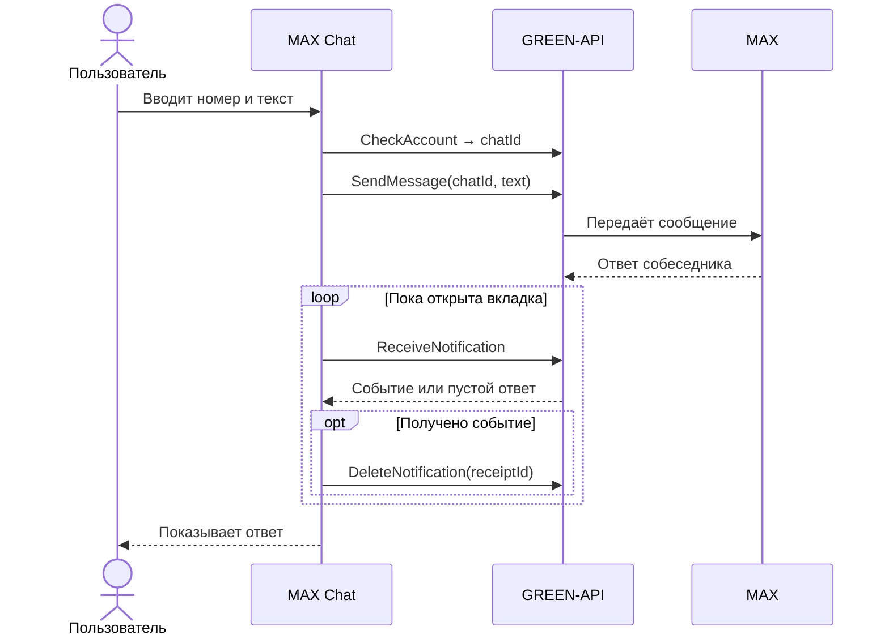

<div align="center">

# 💬 MAX Chat

### Веб-чат для текстовой переписки в MAX через GREEN-API

Подключите свой инстанс, добавьте собеседника по номеру телефона и общайтесь в браузере.


</div>

---

## О проекте

**MAX Chat** — React-приложение для личных текстовых сообщений в мессенджере MAX. Оно работает с авторизованным инстансом [GREEN-API](https://green-api.com/max/) напрямую из браузера. Интерфейс вдохновлён веб-версией MAX и оставляет только действия, нужные для переписки.

При первом входе список чатов пуст. Пользователь сам вводит номер телефона, приложение получает `chatId` через `CheckAccount` и открывает диалог. Сообщения отправляются методом `SendMessage`, ответы поступают через HTTP-очередь `ReceiveNotification` → `DeleteNotification`.

## Возможности

| Сценарий    | Что сделано                                                                                          |
| ----------- | ---------------------------------------------------------------------------------------------------- |
| Подключение | Вход по `idInstance`, `apiTokenInstance` и адресу сервера; проверка состояния и настроек инстанса    |
| Новый чат   | Поиск пользователя MAX по номеру РФ или Беларуси; список пополняется только по действию пользователя |
| Переписка   | Отправка и получение текста, в том числе сообщений со ссылками                                       |
| История     | Последние 100 доступных сообщений выбранного чата, ручное обновление и сверка каждые 30 секунд       |
| Статусы     | Отдельно показаны принятие GREEN-API, отправка в MAX, доставка, прочтение и ошибки                   |
| Интерфейс   | Поиск, непрочитанные сообщения, черновики с пометкой в списке, адаптивная верстка                    |
| Сохранение  | Вход, добавленные номера, выбранный чат и черновики восстанавливаются после обновления страницы      |
| Демо        | Проверка интерфейса без инстанса; ответ собеседника имитируется в браузере                           |

## Как работает обмен сообщениями



Пустой ответ `ReceiveNotification` означает, что новых событий пока нет. `DeleteNotification` подтверждает обработку события и удаляет **уведомление из очереди**, а не сообщение из MAX. Для открытого диалога приложение также загружает историю через `GetChatHistory`.

Ответ `SendMessage` с `idMessage` означает, что GREEN-API **принял сообщение**, но ещё не гарантирует доставку. Статусы доставки и прочтения показываются, если они доступны в уведомлениях или истории API.

## Локальный запуск

Нужны **Node.js 22.12+** и npm. После клонирования репозитория выполните:

```bash
npm ci
npm run dev
```

Откройте [http://127.0.0.1:5173](http://127.0.0.1:5173). Кнопка **«Попробовать демо»** запускает пример без инстанса: добавьте номер, отправьте текст и получите автоматический ответ. Реальные сообщения в деморежиме не отправляются.

## Подключение MAX

1. Создайте инстанс **MAX** в [личном кабинете GREEN-API](https://console.green-api.com/) и авторизуйте свой аккаунт MAX. Состояние должно быть `authorized`.
2. В настройках инстанса оставьте `webhookUrl` пустым и включите `incomingWebhook`. Для статусов исходящих сообщений включите `outgoingWebhook`, `outgoingAPIMessageWebhook` и `outgoingMessageWebhook`.
3. Скопируйте из кабинета `idInstance`, `apiTokenInstance` и `apiUrl`. На странице входа проверьте адрес в разделе **«Сервер API»**: `https://3100.api.green-api.com` задан только по умолчанию.
4. Нажмите **«Открыть чат»**, затем **«Новый чат»** и введите номер собеседника в международном формате, например `+7 999 123 45 67`.
5. Отправьте текст и попросите собеседника ответить в MAX. **Enter** отправляет сообщение, **Shift + Enter** добавляет новую строку.

Для проверки полного сценария нужны **два аккаунта MAX**: подключённый к инстансу и аккаунт собеседника. Приложение проверяет настройки инстанса, но не меняет их. На бесплатном тарифе `MAX Developer` действуют ограничения: три чата и 100 вызовов `CheckAccount` в месяц. Для переписки используется полученный `chatId`.

**Для HTTP-получения нужен один потребитель очереди на инстанс.** Не запускайте параллельно бота или другой клиент, использующий ReceiveNotification/DeleteNotification для того же инстанса. В пределах одного сайта несколько вкладок координируются через Web Locks API. Между разными сайтами этот механизм не действует.

## Стек и структура

- **React 19**, **TypeScript**, **Vite 8** — интерфейс и сборка;
- **Zustand** — состояние сессии, чатов, сообщений и черновиков;
- **Vitest** и **React Testing Library** — автоматические проверки;
- **ESLint** и **Prettier** — анализ и форматирование кода.

Код разделён по [Feature-Sliced Design](https://feature-sliced.design/):

```text
src/
├── app/       # запуск и сохранение локального состояния
├── pages/     # страницы подключения и переписки
├── widgets/   # список чатов и окно диалога
├── features/  # подключение, новый чат, отправка, получение, история
├── entities/  # модели сессии и переписки
└── shared/    # API-клиент, форматирование и общие компоненты
```

Подробнее о потоках сообщений — в [docs/architecture.md](docs/architecture.md).

## Данные и ограничения

Приложение не использует собственный сервер или базу данных. Для автоматического входа `idInstance`, `apiTokenInstance`, `apiUrl`, добавленные номера и черновики хранятся в `localStorage` браузера до нажатия **«Выйти»**. Токен и черновики доступны скриптам и расширениям этого браузера; используйте приложение только на доверенном устройстве. Токен также виден владельцу браузера в адресах запросов GREEN-API в DevTools.

- Сообщения не сохраняются локально. При открытии диалога запрашиваются последние 100 доступных сообщений. GREEN-API возвращает только историю, которую предоставляет MAX; старые сообщения могут отсутствовать.
- Чаты создаются **только по номерам, добавленным пользователем**. События из остальных чатов не появляются в списке.
- Поддерживаются личные текстовые сообщения до 4000 символов. Файлы, голосовые сообщения, группы, редактирование и удаление сообщений не реализованы, поскольку не входят в задачу.
- Уведомления хранятся в очереди GREEN-API 24 часа. Неподдерживаемые события тоже подтверждаются, чтобы очередь продолжала работать.
- Если ответ на `SendMessage` потерялся, сообщение могло дойти. Приложение не повторяет отправку автоматически: сначала обновите историю чата.

## Проверка и сборка

```bash
npm run check         # ESLint, границы FSD, тесты и production-сборка
npm run format:check  # проверка форматирования
npm run build         # сборка в dist/
npm run preview       # локальный просмотр сборки
```

Сценарии с реальным инстансом собраны в [docs/testing.md](docs/testing.md). Автоматические тесты используют подменённый HTTP-транспорт и не заменяют проверку отправки и получения с двумя аккаунтами MAX.

Для публикации нужен статический HTTPS-хостинг: выполните `npm ci && npm run build` и разместите каталог `dist/`. Серверные переменные с ключами не требуются — каждый пользователь вводит данные своего инстанса в браузере.

## Документация GREEN-API

- [Подготовка инстанса](https://green-api.com/v3/docs/before-start/)
- [CheckAccount](https://green-api.com/v3/docs/api/service/CheckAccount/)
- [SendMessage](https://green-api.com/v3/docs/api/sending/SendMessage/)
- [Получение через HTTP API](https://green-api.com/v3/docs/api/receiving/technology-http-api/)
- [GetChatHistory](https://green-api.com/v3/docs/api/journals/GetChatHistory/)
- [Идентификатор чата](https://green-api.com/v3/docs/api/chat-id/)
