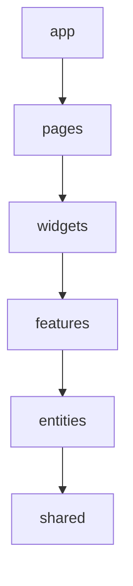

# Как устроен проект

Архитектура следует FSD: код группируется по предметной области и назначению. У каждого слайса есть публичный `index.ts`. Внешний код импортирует слайс через него; внутренние файлы используют относительные импорты. Проверка `npm run lint:fsd` анализирует импорты через AST TypeScript и запрещает зависимости вверх, между слайсами одного слоя и обход публичных API.

Стили расположены рядом с компонентами в сегменте `ui`. Общие кнопки, поля и диалоги оформлены в `shared/ui/ui.css`. В `app/styles/global.css` остаются шрифты, переменные и базовые правила документа. Классы компонентов имеют префиксы, чтобы избегать случайных пересечений.

```text
src/
  app/                         запуск, общие стили, обработка ошибок React
  pages/
    connect/                   страница подключения
    chat/                      сборка рабочего пространства
  widgets/
    chat-sidebar/              список и поиск диалогов
    conversation/              заголовок, история, поле сообщения
  features/
    connect-instance/          подключиться к GREEN-API
    start-chat/                найти получателя и открыть диалог
    send-message/              отправить текст
    receive-messages/          получать и подтверждать уведомления
    load-history/              загрузить историю выбранного диалога
  entities/
    session/                   активное подключение
    conversation/              чат, сообщения, черновики и их обновления
  shared/
    api/                       HTTP-клиент, ошибки, контракты, демоклиент
    lib/                       форматирование, проверки, отменяемая задержка
    ui/                        аватар, знак приложения, модальное окно
```

Допустимое направление зависимостей:



Можно пропускать слои: страница вправе напрямую использовать `shared/ui` или сущность. Слайсы одного слоя не импортируют друг друга. `app` и `shared` разбиты сразу на технические сегменты. Для этого проекта используется классическая шестислойная схема FSD; дополнительные слои не требуются.

## Почему чат и сообщения в одной сущности

Чат содержит сообщения, непрочитанные, состояние загрузки истории и черновик. При входящем сообщении несколько частей этих данных меняются одной операцией. Единый слайс `conversation` позволяет делать это без взаимных импортов `chat` и `message`. В нём нет сетевых запросов: он принимает уже разобранные данные.

Zustand выбран для небольшого общего состояния, которое читают список чатов, переписка и обработчик уведомлений. Обновления выполняются синхронно, поэтому обработчик может сначала записать событие, затем подтвердить его API. Фабрика `createConversationStore` создаёт независимое хранилище для тестов. Текст открытой формы подключения остаётся в локальном состоянии компонента.

## Путь исходящего сообщения

1. `MessageComposer` получает текст из черновика выбранного чата.
2. Перед отправкой проверяет пустой текст и лимит 4000 символов. Enter во время IME-композиции не отправляет сообщение.
3. В хранилище добавляется сообщение с временным идентификатором `local-…` и состоянием `sending`. Черновик очищается, чтобы можно было писать следующий текст.
4. `session.api.sendMessage` выполняет HTTP-запрос. HTTP-клиент отвечает за URL, сериализацию, таймаут и проверку ответа.
5. `settleMessage` связывает временный идентификатор с `idMessage`, полученным от GREEN-API. Состояние становится `queued`, если уже не пришёл более поздний статус.
6. Уведомления `sent`, `delivered`, `read` обновляют ту же запись. Ранний приход серверной копии или статуса не создаёт второе сообщение.

Временный `clientId` сохраняется для React `key`: обновление серверного идентификатора не должно само по себе пересоздавать элемент сообщения.

## Путь входящего сообщения

`useReceiveMessages` связывает жизненный цикл React с `pollNotifications`. Цикл делает только один запрос получения за раз. При ответе с событием он вызывает синхронный обработчик, затем подтверждает `receiptId`. В списке показываются только чаты, которые пользователь открыл по номеру; уведомления от остальных чатов не создают диалог автоматически.

`parseIncoming` проверяет тип события, идентификаторы, время и текст. История приходит в другой форме; её разбирает `parseHistory`. Оба преобразования возвращают одну модель `Message`, с которой работает интерфейс. Данные API проверяются на границе: TypeScript сам по себе не проверяет JSON из сети.

Повторный `idMessage` обновляет существующую запись и не увеличивает счётчик непрочитанных. Ответ истории объединяется с уже полученными сообщениями, поэтому более медленная загрузка не стирает новые данные.

При ошибке подтверждения цикл держит текущее событие и повторяет только удаление уведомления. При временных сетевых ошибках интервалы ожидания растут от 1 до 30 секунд. При постоянной ошибке цикл останавливается и показывает причину. Сервисное событие о недоступном инстансе подтверждается перед остановкой, чтобы не блокировать следующее подключение.

## Отмена и несколько вкладок

Каждая сессия имеет `AbortController`. Выход отменяет её сетевые запросы. Эффекты также создают свои контроллеры: смена чата прекращает старый запрос истории, а очистка эффекта останавливает получение уведомлений. Это важно и при проверочном повторном запуске эффектов в React StrictMode.

`navigator.locks` разрешает только одной вкладке текущего origin потреблять очередь инстанса. Следующая вкладка ждёт освобождения блокировки. В браузере без Web Locks используется один цикл на вкладку; в таком случае приложение следует открывать в одной вкладке.

## Что сознательно ограничено

- Данные подключения сохраняются в `localStorage` для восстановления после перезагрузки; выход удаляет их из браузера. Защита токена от скриптов и расширений браузера без собственного сервера не обеспечивается.
- Список чатов пуст при первом входе. Добавленные номера, выбранный чат и черновики сохраняются в браузере до выхода; сообщения заново загружаются из API.
- Загружаются последние 100 сообщений, без пагинации.
- Проект получает все доступные уведомления инстанса, но отображает только личные текстовые сообщения.
- Получение статусов зависит от настроек GREEN-API; приложение не выдумывает доставку.
- `SendMessage` не имеет используемого здесь ключа идемпотентности. Потеря ответа оставляет неопределённость, поэтому автоматический повтор отправки отключён.
- Собственный сервер не нужен для текущего браузерного API. Проверенный кластер поддерживает CORS; при смене инфраструктуры доступность нужно проверить заново.

## Как разбирать код

Начните с `app/app.tsx`: он переключает две страницы по наличию сессии. Затем откройте `ConnectForm`, чтобы проследить создание API-клиента и сессии. После этого изучите `MessageComposer` и методы хранилища `addMessage`/`settleMessage`. Последним разберите цикл `pollNotifications` вместе с его тестами: они показывают, зачем подтверждение события выполняется после обработки и как работает повтор.
